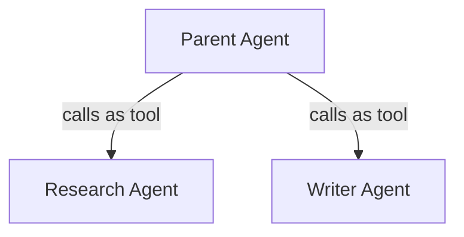

# 14 – Agent-as-Tool

!!! abstract "Module Goals"
    Register an agent as a callable tool for another agent, enabling hierarchical agent composition.

## Key Concepts

| Concept | Description |
|---------|-------------|
| `AgentTool(agent=...)` | Wrap an agent as a tool |
| Parent agent | Invokes child agent via tool |
| Isolation | Child agent has own instructions/tools |
| Composability | Build complex agents from simpler ones |

## Pattern



## Code

```python title="modules/14_agent_as_tool/main.py"
--8<-- "modules/14_agent_as_tool/main.py"
```

## Run It

```bash
uv run python modules/14_agent_as_tool/main.py
```

## Exercises

- [ ] Create a research + writing agent composition
- [ ] Nest 3 levels deep (agent → agent → agent)
- [ ] Compare Agent-as-Tool vs Supervisor patterns

!!! tip "Next"
    [15 – Supervisor Agent](15-supervisor-agent.md)
