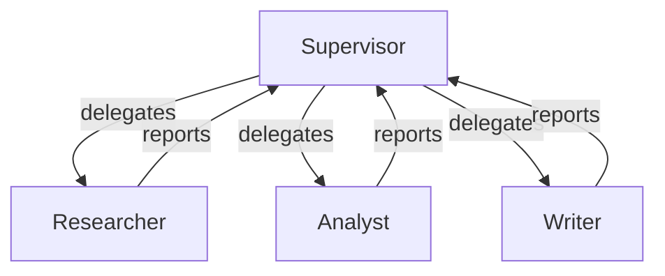

# 15 – Supervisor Agent

!!! abstract "Module Goals"
    Build a supervisor agent that dynamically orchestrates a team of specialist agents.

## Key Concepts

| Concept | Description |
|---------|-------------|
| `SupervisorAgent` | Orchestrates multiple agents |
| Dynamic routing | LLM decides which agent to delegate to |
| Team composition | Define specialist agents |
| Result aggregation | Combine outputs from specialists |

## Pattern



## Code

```python title="modules/15_supervisor_agent/main.py"
--8<-- "modules/15_supervisor_agent/main.py"
```

## Run It

```bash
uv run python modules/15_supervisor_agent/main.py
```

## Exercises

- [ ] Build a team of 3+ specialist agents
- [ ] Add tool-equipped specialist agents
- [ ] Compare supervisor vs handoff workflow patterns

!!! tip "Next"
    [16 – Sub-Workflows](16-sub-workflows.md)
