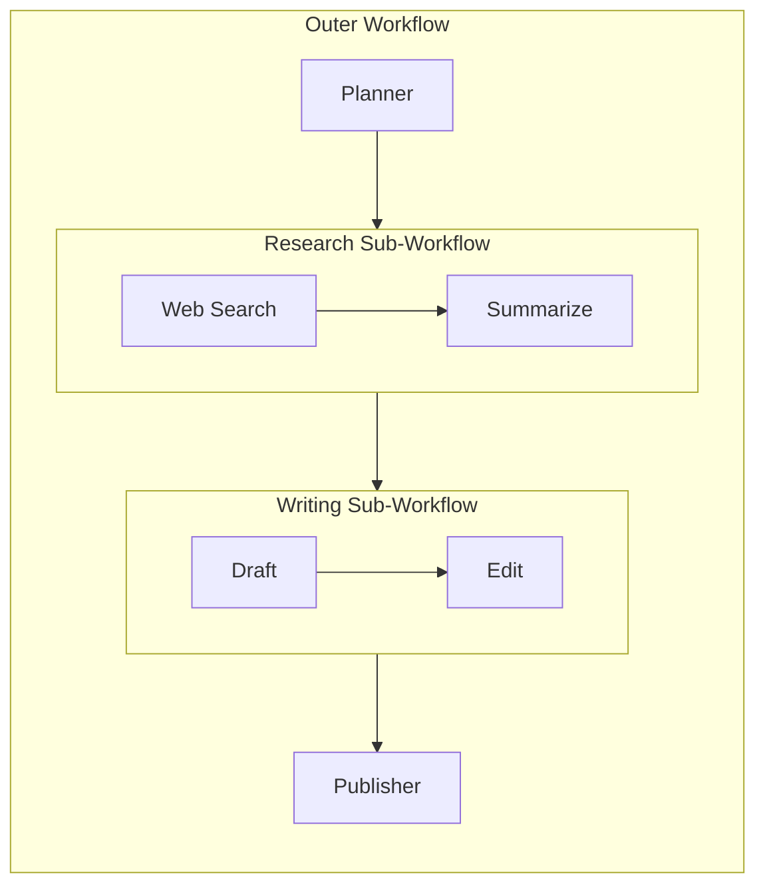

# 16 – Sub-Workflows

!!! abstract "Module Goals"
    Nest workflows inside workflows — compose complex multi-stage pipelines from reusable parts.

## Key Concepts

| Concept | Description |
|---------|-------------|
| Inner workflow | A self-contained workflow |
| Outer workflow | Orchestrates inner workflows |
| Composition | Combine sequential + concurrent patterns |
| Reusability | Inner workflows are modular |

## Pattern



## Code

```python title="modules/16_sub_workflows/main.py"
--8<-- "modules/16_sub_workflows/main.py"
```

## Run It

```bash
uv run python modules/16_sub_workflows/main.py
```

## Exercises

- [ ] Compose sequential + concurrent sub-workflows
- [ ] Create a reusable research sub-workflow
- [ ] Build a 3-level nested workflow

!!! tip "Next"
    [17 – Human-in-the-Loop](17-human-in-the-loop.md)
