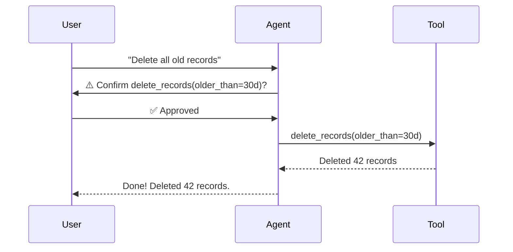

# 17 – Human-in-the-Loop

!!! abstract "Module Goals"
    Add approval gates and user confirmation steps before sensitive actions.

## Key Concepts

| Concept | Description |
|---------|-------------|
| HITL callback | Pause execution for user input |
| Approval gate | Require confirmation before tool call |
| `requires_approval` | Mark tools as needing approval |
| Rejection handling | Graceful fallback on denial |

## Flow



## Code

```python title="modules/17_human_in_the_loop/main.py"
--8<-- "modules/17_human_in_the_loop/main.py"
```

## Run It

```bash
uv run python modules/17_human_in_the_loop/main.py
```

## Exercises

- [ ] Add approval gates to destructive operations
- [ ] Implement a multi-step approval chain
- [ ] Handle timeout/rejection scenarios

!!! tip "Next"
    [18 – Memory & Persistence](18-memory-persistence.md)
