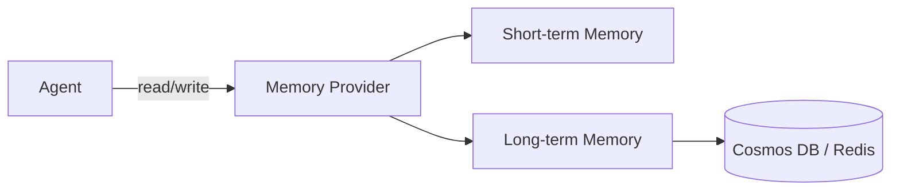

# 18 – Memory & Persistence

!!! abstract "Module Goals"
    Enable agents to remember information across conversations using memory providers.

## Key Concepts

| Concept | Description |
|---------|-------------|
| `MemoryProvider` | Interface for agent memory |
| Short-term memory | Within a single thread |
| Long-term memory | Across threads/conversations |
| `InMemoryMemoryProvider` | Built-in in-memory store |
| Custom providers | Cosmos DB, Redis, etc. |

## Architecture



## Code

```python title="modules/18_memory_persistence/main.py"
--8<-- "modules/18_memory_persistence/main.py"
```

## Run It

```bash
uv run python modules/18_memory_persistence/main.py
```

## Exercises

- [ ] Use built-in memory provider
- [ ] Build a custom memory provider
- [ ] Test memory across multiple conversations

!!! tip "Next"
    [19 – Observability](19-observability.md)
