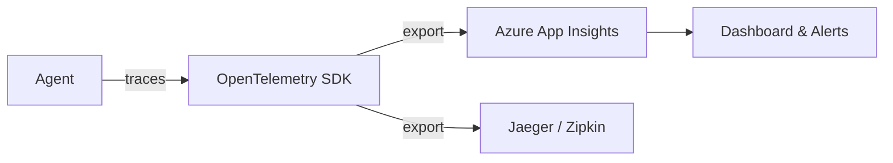

# 19 – Observability

!!! abstract "Module Goals"
    Add tracing, logging, and metrics to monitor agent performance in production.

## Key Concepts

| Concept | Description |
|---------|-------------|
| OpenTelemetry | Standard tracing/metrics framework |
| `configure_azure_monitor()` | App Insights integration |
| Span attributes | Custom trace metadata |
| Token tracking | Monitor LLM token usage |

## Architecture



## Code

```python title="modules/19_observability/main.py"
--8<-- "modules/19_observability/main.py"
```

## Run It

```bash
uv run python modules/19_observability/main.py
```

## Exercises

- [ ] Set up OpenTelemetry tracing
- [ ] Export traces to Azure App Insights
- [ ] Build a Grafana dashboard for agent metrics

!!! tip "Next"
    [20 – Declarative Agents](20-declarative-agents.md)
