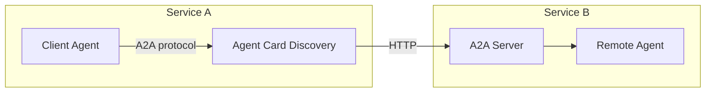

# 21 – Agent-to-Agent (A2A)

!!! abstract "Module Goals"
    Enable communication between remote agents using the Agent-to-Agent protocol.

## Key Concepts

| Concept | Description |
|---------|-------------|
| A2A Protocol | Google's agent interop standard |
| Agent Card | JSON metadata describing an agent |
| Task | Unit of work exchanged between agents |
| A2A Server | Host an agent as an A2A endpoint |
| A2A Client | Call a remote agent via A2A |

## Architecture



## Code

```python title="modules/21_agent_to_agent_a2a/main.py"
--8<-- "modules/21_agent_to_agent_a2a/main.py"
```

## Run It

```bash
uv run python modules/21_agent_to_agent_a2a/main.py
```

## Exercises

- [ ] Create an Agent Card for your agent
- [ ] Host an A2A server
- [ ] Build a cross-service agent system

!!! tip "Next"
    [22 – Deployment](22-deployment.md)
