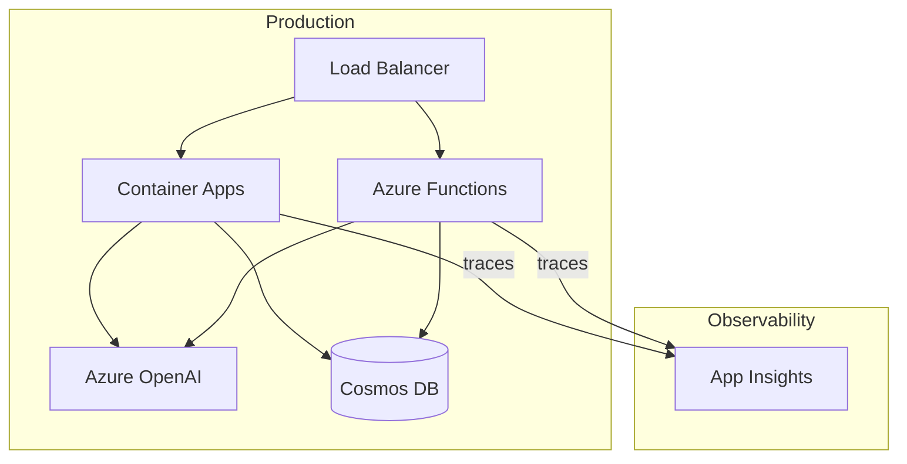

# 22 – Deployment

!!! abstract "Module Goals"
    Deploy agents to production on Azure using containers, serverless, and managed services.

## Key Concepts

| Platform | Pattern | Best For |
|----------|---------|----------|
| Azure Container Apps | Containerized agent | Scalable microservices |
| Azure Functions | Serverless trigger | Event-driven agents |
| Azure App Service | Web-hosted agent | REST API agents |
| Azure AI Foundry | Managed deployment | Enterprise agents |

## Architecture



## Code

```python title="modules/22_deployment/main.py"
--8<-- "modules/22_deployment/main.py"
```

## Run It

```bash
uv run python modules/22_deployment/main.py
```

## Exercises

- [ ] Containerize an agent with Docker
- [ ] Deploy to Azure Container Apps
- [ ] Set up health checks and autoscaling

!!! tip "Next"
    [23 – Capstone Project](23-capstone-project.md)
