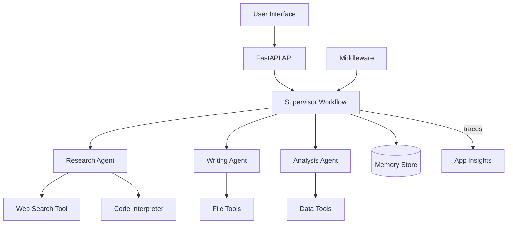

# 23 – Capstone Project

!!! abstract "Module Goals"
    Build a complete multi-agent application combining everything you've learned across all 22 modules.

## Project: AI Research Assistant

A full-featured research assistant that:

- Uses **multiple providers** for different tasks
- Has **function tools** + **hosted tools** + **MCP tools**
- Uses **middleware** for logging and security
- Orchestrates agents via **workflows** (sequential + concurrent)
- Includes **human-in-the-loop** approval for actions
- Has **memory** for conversation continuity
- Is fully **observable** via OpenTelemetry
- Is **deployed** as a containerized service

## Architecture



## Code

```python title="modules/23_capstone_project/main.py"
--8<-- "modules/23_capstone_project/main.py"
```

## Run It

```bash
uv run python modules/23_capstone_project/main.py
```

## Checklist

- [ ] Multiple agent types (basic, tool-equipped, supervisor)
- [ ] At least 2 workflow patterns
- [ ] Middleware for logging
- [ ] Human-in-the-loop for sensitive actions
- [ ] Memory/persistence
- [ ] Observability tracing
- [ ] Docker containerization
- [ ] README with setup instructions

!!! success "Congratulations!"
    You've completed the Microsoft Agent Framework Bootcamp!
