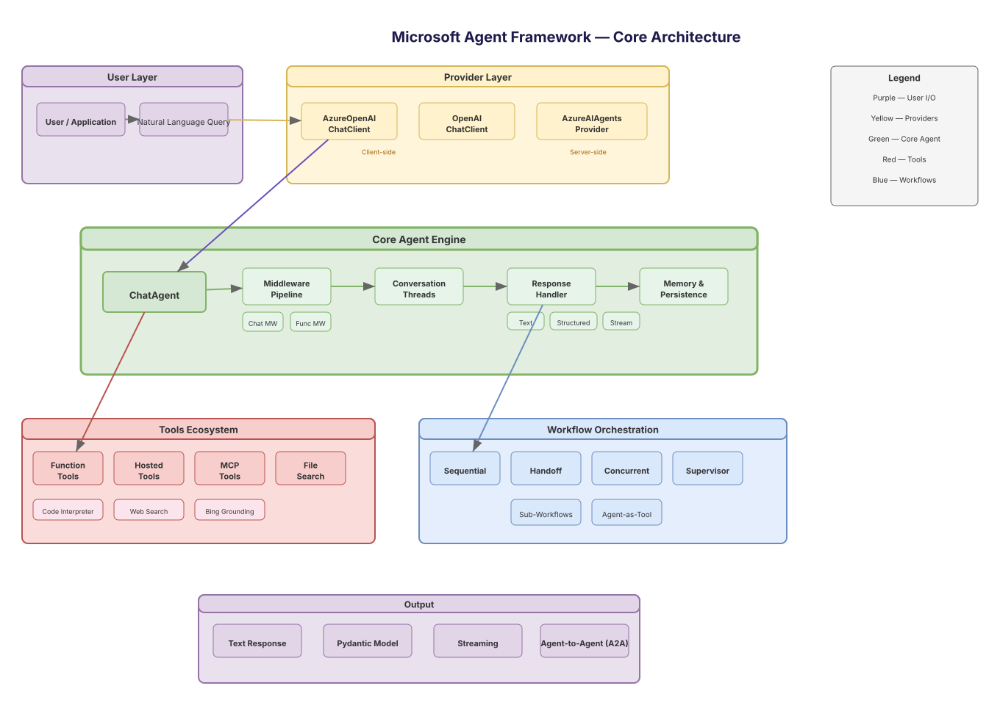
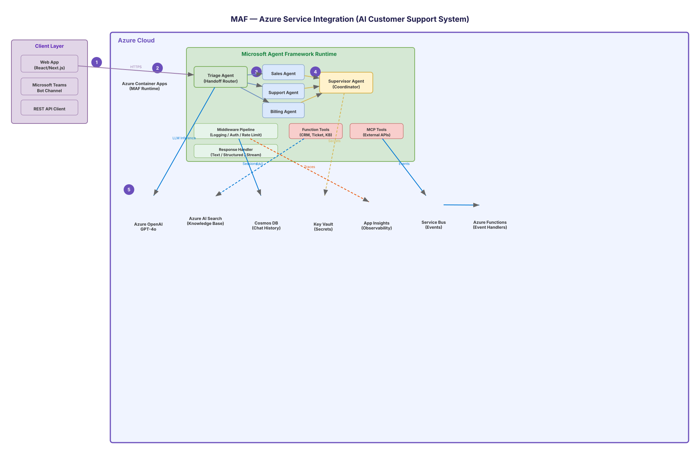
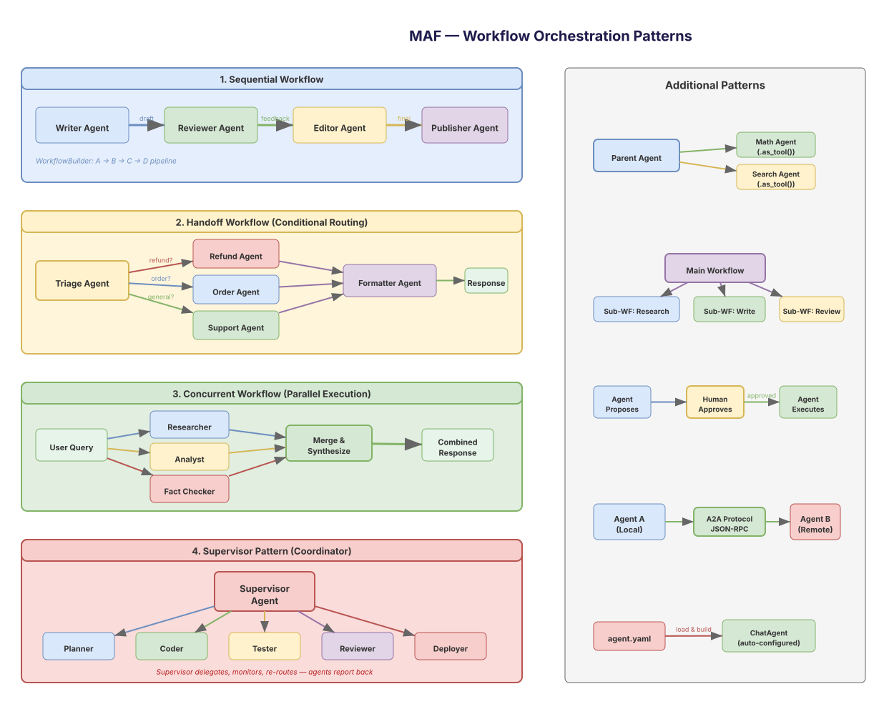
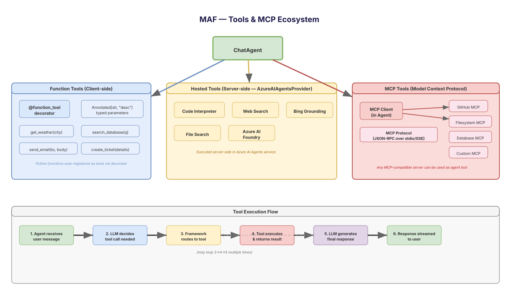
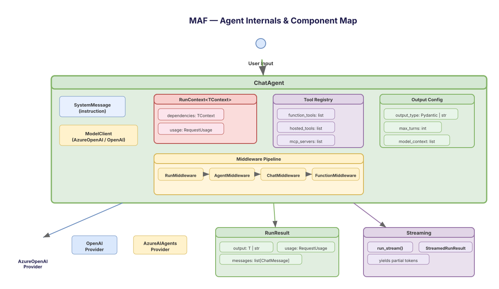
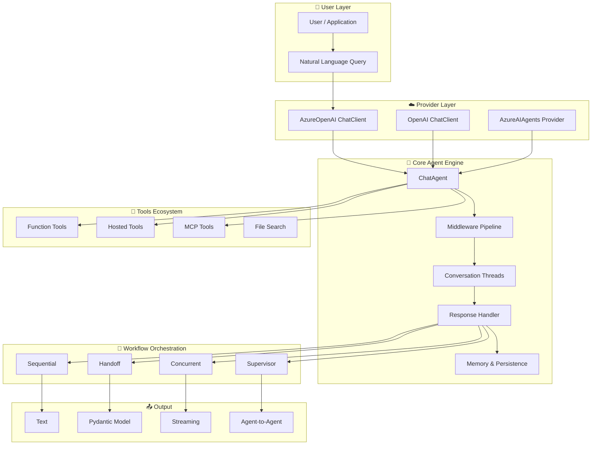
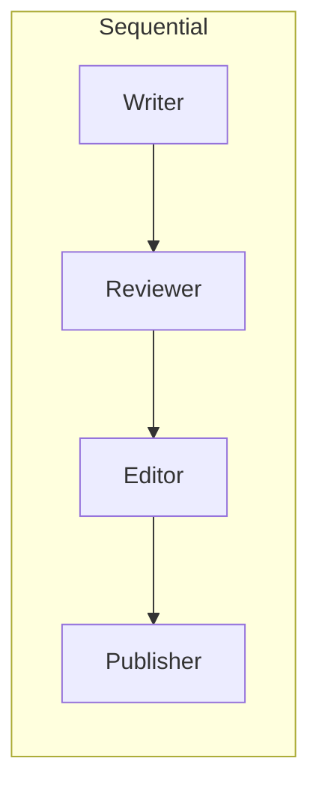
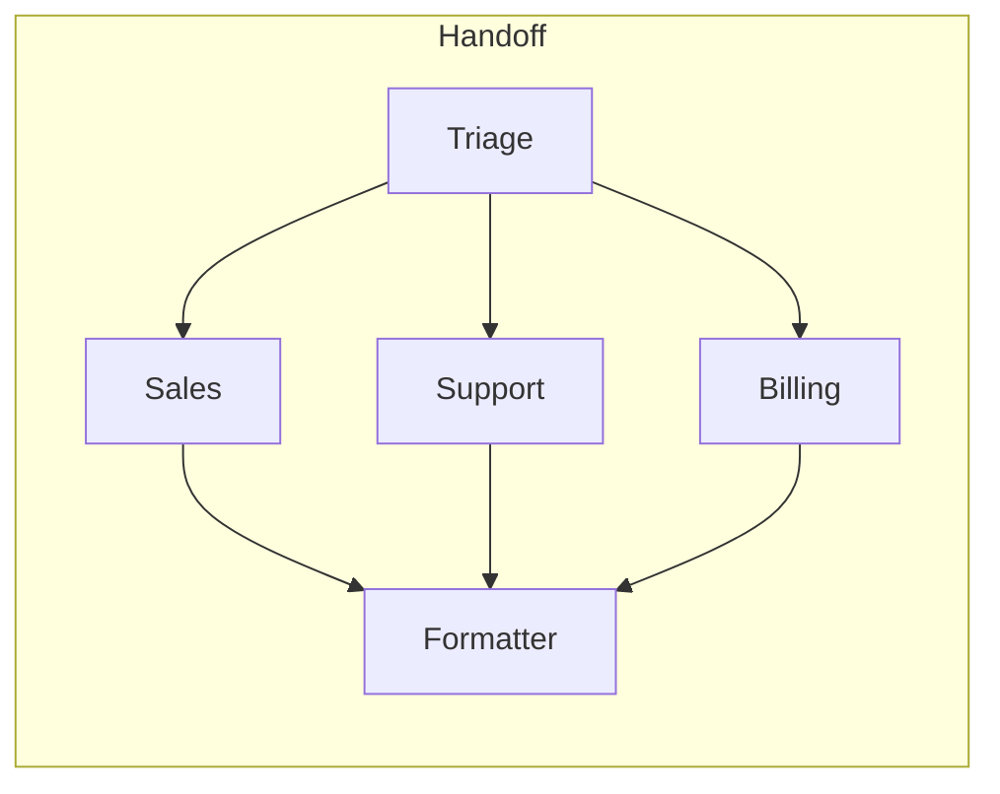
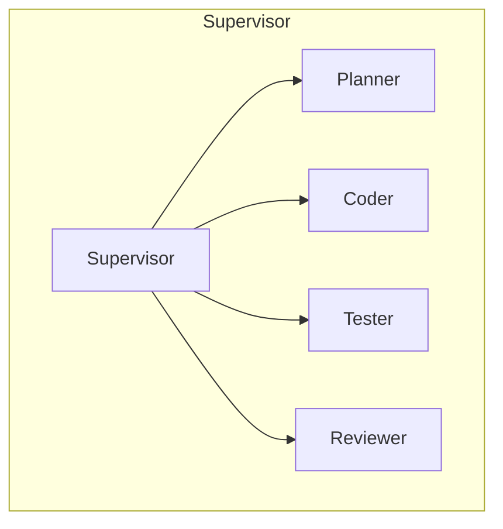

# Architecture

The Microsoft Agent Framework provides a layered, extensible architecture for building AI agent applications. This section contains detailed architecture diagrams and documentation.

!!! tip "Zoom any diagram"
    Click any diagram or Mermaid chart on this site to open it in a **fullscreen viewer** with zoom, pan, and drag support.

## Architecture Diagrams

-   :material-layers-outline:{ .lg .middle } **Core Architecture**

    ---

    Complete framework overview — User Layer → Providers → Agent Core → Tools → Workflows → Output.

    

      
    

    [:octicons-download-16: Download .drawio](diagrams/01-core-architecture.drawio){ .md-button .md-button--primary }

-   :material-microsoft-azure:{ .lg .middle } **Azure Service Integration**

    ---

    Real-world multi-agent customer support system with Azure OpenAI, Cosmos DB, AI Search, Service Bus & more.

    

      
    

    [:octicons-download-16: Download .drawio](diagrams/02-azure-integration.drawio){ .md-button .md-button--primary }

-   :material-arrow-decision-outline:{ .lg .middle } **Workflow Patterns**

    ---

    All 9 orchestration patterns: Sequential, Handoff, Concurrent, Supervisor, Agent-as-Tool, Sub-Workflows, HITL, A2A, Declarative.

    

      
    

    [:octicons-download-16: Download .drawio](diagrams/03-workflow-patterns.drawio){ .md-button .md-button--primary }

-   :material-tools:{ .lg .middle } **Tools & MCP Ecosystem**

    ---

    Function Tools, Hosted Tools (Code Interpreter, Web Search), MCP Protocol flow, and the tool execution lifecycle.

    

      
    

    [:octicons-download-16: Download .drawio](diagrams/04-tools-mcp.drawio){ .md-button .md-button--primary }

-   :material-cog-outline:{ .lg .middle } **Agent Internals & Components**

    ---

    Deep dive into ChatAgent internals — SystemMessage, RunContext, Tool Registry, Middleware Pipeline, Output Config, Providers, Streaming.

    

      
    

    [:octicons-download-16: Download .drawio](diagrams/05-agent-components.drawio){ .md-button .md-button--primary }

---

## Framework Architecture Overview

## Provider Model

| Provider | Execution | Tools Support | Use Case |
|----------|-----------|---------------|----------|
| **AzureOpenAIChatClient** | Client-side | Function Tools, MCP | Direct Azure OpenAI access |
| **OpenAIChatClient** | Client-side | Function Tools, MCP | OpenAI API access |
| **AzureAIAgentsProvider** | Server-side | All (incl. Hosted) | Full Azure AI Agents service |

## Workflow Patterns

