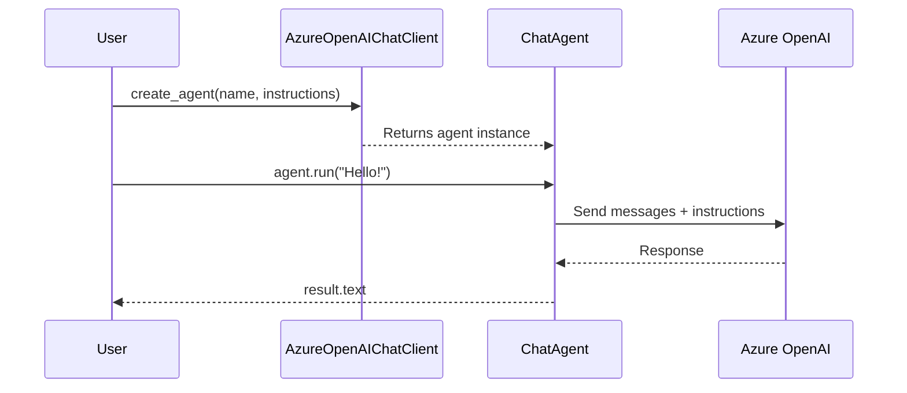

# 02 – Hello Agent

!!! abstract "Module Goals"
    Create your first agent, understand the agent lifecycle, and run a basic single-turn conversation.

## Key Concepts

| Concept | Description |
|---------|-------------|
| `AzureOpenAIChatClient` | Provider connecting to Azure OpenAI |
| `create_agent()` | Factory method to create a ChatAgent |
| `instructions` | System prompt that defines agent behavior |
| `agent.run()` | Execute agent with a user message |
| `result.text` | Extract the response text |

## Architecture



## Code

```python title="modules/02_hello_agent/main.py"
--8<-- "modules/02_hello_agent/main.py"
```

## Run It

```bash
uv run python modules/02_hello_agent/main.py
```

## Exercises

- [ ] Create a basic "Hello World" agent
- [ ] Experiment with different `instructions` (try different personalities)
- [ ] Create a specialized agent (e.g., "You are a pirate who explains tech")
- [ ] Print the full `result` object to understand its structure

!!! tip "Next"
    [03 – Providers Deep Dive](03-providers-deep-dive.md)
