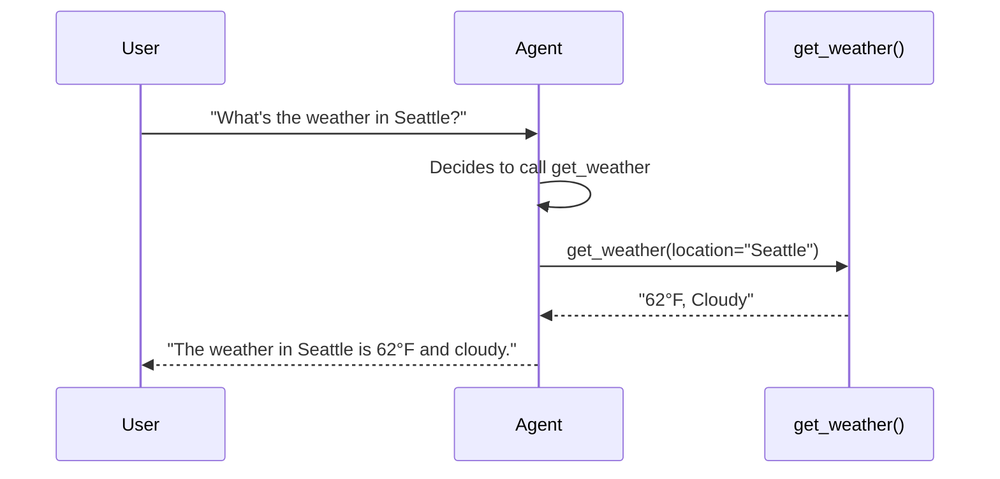

# 04 – Function Tools

!!! abstract "Module Goals"
    Create custom function tools, use typed parameters, and combine multiple tools in one agent.

## Key Concepts

| Concept | Description |
|---------|-------------|
| Function tools | Regular Python functions exposed to agents |
| `Annotated[type, Field()]` | Typed params with descriptions |
| Docstrings | Used as tool descriptions |
| `tools=[...]` | Pass functions directly to agent |

## How It Works



## Code

```python title="modules/04_function_tools/main.py"
--8<-- "modules/04_function_tools/main.py"
```

## Run It

```bash
uv run python modules/04_function_tools/main.py
```

## Exercises

- [ ] Create a weather lookup tool
- [ ] Create a time/date tool
- [ ] Create a calculator tool
- [ ] Combine multiple tools and observe tool selection
- [ ] Try calling the agent with a query that needs 2+ tools

!!! tip "Next"
    [05 – Conversation Threads](05-conversation-threads.md)
