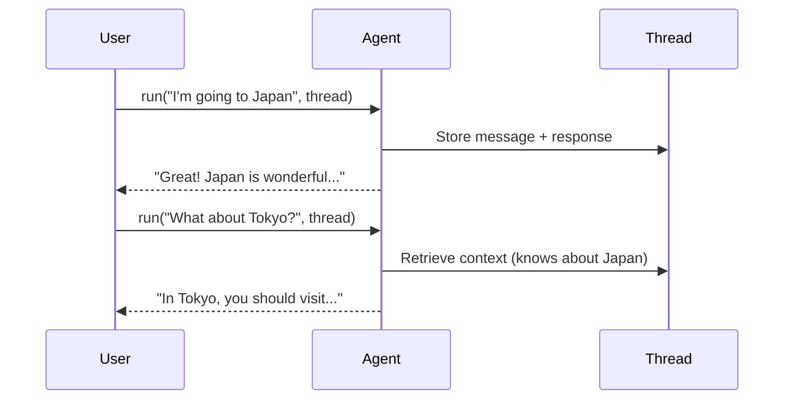

# 05 – Conversation Threads

!!! abstract "Module Goals"
    Create multi-turn conversations with persistent context using threads.

## Key Concepts

| Concept | Description |
|---------|-------------|
| `agent.get_new_thread()` | Create a new conversation thread |
| `thread=thread` | Pass thread to `run()` for context |
| `thread.conversation_id` | Unique ID for the thread |
| Multi-turn | Agent remembers previous messages |

## How Threads Work



## Code

```python title="modules/05_conversation_threads/main.py"
--8<-- "modules/05_conversation_threads/main.py"
```

## Run It

```bash
uv run python modules/05_conversation_threads/main.py
```

## Exercises

- [ ] Create a multi-turn travel planning conversation
- [ ] Compare responses **with** and **without** threads
- [ ] Save and display the thread ID

!!! tip "Next"
    [06 – Streaming Responses](06-streaming-responses.md)
