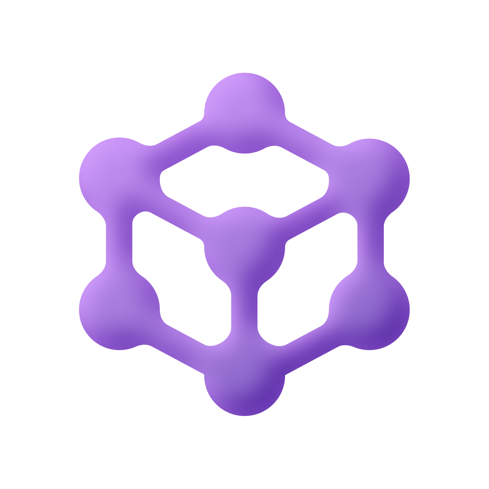

---
hide:
  - navigation
  - toc
---

<!-- HERO -->
<section class="tx-hero">
  <div class="tx-hero__content">
    
    <h1 class="tx-hero__title">Microsoft Agent Framework<br><span>Bootcamp</span></h1>
    <p class="tx-hero__subtitle">A structured, hands-on learning path — from your first AI agent to production deployment. Master the Python SDK through 23 progressive modules.</p>
    <div class="tx-hero__actions">
      <a href="basic/01-setup-and-configuration/" class="tx-btn tx-btn--primary">
        Get Started <span class="tx-btn__arrow">→</span>
      </a>
      <a href="learning-plan/" class="tx-btn tx-btn--ghost">
        View Learning Plan
      </a>
    </div>
    <div class="tx-hero__stats">
      <div class="tx-stat">
        <span class="tx-stat__number">23</span>
        <span class="tx-stat__label">Modules</span>
      </div>
      <div class="tx-stat">
        <span class="tx-stat__number">3</span>
        <span class="tx-stat__label">Levels</span>
      </div>
      <div class="tx-stat">
        <span class="tx-stat__number">50+</span>
        <span class="tx-stat__label">Exercises</span>
      </div>
      <div class="tx-stat">
        <span class="tx-stat__number">Python</span>
        <span class="tx-stat__label">SDK</span>
      </div>
    </div>
  </div>
</section>

<!-- FEATURES — alternating layout like mkdocs-material -->
<section class="tx-features">
  <div class="tx-features__header">
    <h2>Everything you need to build AI agents</h2>
    <p>From simple chat agents to enterprise multi-agent systems — learn it all step by step.</p>
  </div>

  <div class="tx-feature tx-feature--left">
    <div class="tx-feature__text">
      <span class="tx-feature__icon">🚀</span>
      <h3>Start in minutes</h3>
      <p>Set up your environment with <code>uv</code>, configure Azure OpenAI, and build your first conversational agent — all in Module 01. No boilerplate, no confusion.</p>
    </div>
    <div class="tx-feature__visual tx-feature__visual--code">
<div class="highlight"><pre><span></span><code><span class="kn">from</span> <span class="nn">agent_framework</span> <span class="kn">import</span> <span class="n">ChatAgent</span>
<span class="kn">from</span> <span class="nn">agent_framework.providers</span> <span class="kn">import</span> <span class="n">AzureOpenAIProvider</span>

<span class="n">agent</span> <span class="o">=</span> <span class="n">ChatAgent</span><span class="p">(</span>
    <span class="n">name</span><span class="o">=</span><span class="s2">"my-first-agent"</span><span class="p">,</span>
    <span class="n">instructions</span><span class="o">=</span><span class="s2">"You are a helpful assistant."</span><span class="p">,</span>
    <span class="n">provider</span><span class="o">=</span><span class="n">AzureOpenAIProvider</span><span class="p">()</span>
<span class="p">)</span>
<span class="n">response</span> <span class="o">=</span> <span class="k">await</span> <span class="n">agent</span><span class="o">.</span><span class="n">run</span><span class="p">(</span><span class="s2">"Hello!"</span><span class="p">)</span></code></pre></div>
    </div>
  </div>

  <div class="tx-feature tx-feature--right">
    <div class="tx-feature__text">
      <span class="tx-feature__icon">🛠️</span>
      <h3>Tools, MCP & hosted capabilities</h3>
      <p>Give agents real superpowers — Function Tools, Model Context Protocol (MCP), Code Interpreter, Web Search, and Bing Grounding — all with type-safe decorators.</p>
    </div>
    <div class="tx-feature__visual tx-feature__visual--list">
      <div class="tx-pill-grid">
        <span class="tx-pill tx-pill--purple">Function Tools</span>
        <span class="tx-pill tx-pill--blue">MCP Protocol</span>
        <span class="tx-pill tx-pill--green">Code Interpreter</span>
        <span class="tx-pill tx-pill--orange">Web Search</span>
        <span class="tx-pill tx-pill--pink">Bing Grounding</span>
        <span class="tx-pill tx-pill--teal">File Search</span>
      </div>
    </div>
  </div>

  <div class="tx-feature tx-feature--left">
    <div class="tx-feature__text">
      <span class="tx-feature__icon">🔀</span>
      <h3>Powerful workflow orchestration</h3>
      <p>Chain agents in sequential pipelines, hand off between specialists, or run them concurrently. Build complex multi-agent workflows with simple, composable patterns.</p>
    </div>
    <div class="tx-feature__visual tx-feature__visual--diagram">
      <div class="tx-flow">
        <div class="tx-flow__node tx-flow__node--blue">Triage</div>
        <div class="tx-flow__arrow">→</div>
        <div class="tx-flow__branch">
          <div class="tx-flow__node tx-flow__node--green">Sales</div>
          <div class="tx-flow__node tx-flow__node--purple">Support</div>
          <div class="tx-flow__node tx-flow__node--orange">Billing</div>
        </div>
        <div class="tx-flow__arrow">→</div>
        <div class="tx-flow__node tx-flow__node--teal">Response</div>
      </div>
    </div>
  </div>

  <div class="tx-feature tx-feature--right">
    <div class="tx-feature__text">
      <span class="tx-feature__icon">🏗️</span>
      <h3>Production-grade patterns</h3>
      <p>Supervisor agents, human-in-the-loop approvals, persistent memory, observability with tracing & metrics, and Docker-based Azure deployment — enterprise-ready from day one.</p>
    </div>
    <div class="tx-feature__visual tx-feature__visual--list">
      <div class="tx-checklist">
        <div class="tx-check">✅ Supervisor + Worker pattern</div>
        <div class="tx-check">✅ Human-in-the-Loop gates</div>
        <div class="tx-check">✅ Memory & session persistence</div>
        <div class="tx-check">✅ OpenTelemetry tracing</div>
        <div class="tx-check">✅ A2A interoperability</div>
        <div class="tx-check">✅ Azure Container deployment</div>
      </div>
    </div>
  </div>
</section>

<!-- LEARNING TRACKS -->
<section class="tx-tracks">
  <div class="tx-tracks__header">
    <h2>Choose your learning track</h2>
    <p>Three progressive levels — pick where to start based on your experience.</p>
  </div>
  <div class="tx-tracks__grid">
    <a href="basic/" class="tx-track tx-track--basic">
      <div class="tx-track__badge">Beginner</div>
      <span class="tx-track__icon">🟢</span>
      <h3>Basic</h3>
      <span class="tx-track__range">Modules 01 – 06</span>
      <p>Environment setup, your first agent, providers, Function Tools, conversation threads, and streaming responses.</p>
      <span class="tx-track__cta">Start learning →</span>
    </a>
    <a href="intermediate/" class="tx-track tx-track--intermediate">
      <div class="tx-track__badge">Intermediate</div>
      <span class="tx-track__icon">🟡</span>
      <h3>Intermediate</h3>
      <span class="tx-track__range">Modules 07 – 13</span>
      <p>Structured outputs, hosted & MCP tools, middleware pipelines, and workflow orchestration patterns.</p>
      <span class="tx-track__cta">Continue learning →</span>
    </a>
    <a href="advanced/" class="tx-track tx-track--advanced">
      <div class="tx-track__badge">Advanced</div>
      <span class="tx-track__icon">🔴</span>
      <h3>Advanced</h3>
      <span class="tx-track__range">Modules 14 – 23</span>
      <p>Agent composition, supervisors, human-in-the-loop, memory, A2A protocol, observability, and deployment.</p>
      <span class="tx-track__cta">Master the framework →</span>
    </a>
  </div>
</section>

<!-- ARCHITECTURE & EXAMPLES -->
<section class="tx-features">
  <div class="tx-features__header">
    <h2>Explore architecture & examples</h2>
    <p>Understand how the framework is built and see real-world code.</p>
  </div>

  <div class="tx-feature tx-feature--left">
    <div class="tx-feature__text">
      <span class="tx-feature__icon">📐</span>
      <h3>Architecture diagrams</h3>
      <p>Deep-dive into the core framework design, Azure integration patterns, workflow orchestration models, MCP tool ecosystem, and agent internals — with downloadable Draw.io diagrams.</p>
      <a href="architecture/" class="tx-btn tx-btn--primary" style="margin-top:1rem;display:inline-block;">
        Browse Architecture →
      </a>
    </div>
    <div class="tx-feature__visual tx-feature__visual--list">
      <div class="tx-checklist">
        <div class="tx-check">📋 Core Architecture Overview</div>
        <div class="tx-check">☁️ Azure Integration Patterns</div>
        <div class="tx-check">🔀 9 Workflow Patterns</div>
        <div class="tx-check">🔧 Tools & MCP Ecosystem</div>
        <div class="tx-check">⚙️ Agent Components & Internals</div>
      </div>
    </div>
  </div>

  <div class="tx-feature tx-feature--right">
    <div class="tx-feature__text">
      <span class="tx-feature__icon">💻</span>
      <h3>Working examples</h3>
      <p>Runnable Python examples covering agents, MCP clients, MCP servers, and custom agent-skill providers. Every example links directly to the GitHub source.</p>
      <a href="examples/" class="tx-btn tx-btn--ghost" style="margin-top:1rem;display:inline-block;">
        View Examples →
      </a>
    </div>
    <div class="tx-feature__visual tx-feature__visual--list">
      <div class="tx-pill-grid">
        <span class="tx-pill tx-pill--purple">Agents</span>
        <span class="tx-pill tx-pill--blue">MCP Clients</span>
        <span class="tx-pill tx-pill--green">MCP Servers</span>
        <span class="tx-pill tx-pill--orange">Skill Providers</span>
      </div>
    </div>
  </div>
</section>

<!-- FULL MODULE INDEX -->
<section class="tx-modules">
  <div class="tx-modules__header">
    <h2>Full module index</h2>
    <p>23 modules covering every aspect of the Microsoft Agent Framework.</p>
  </div>

| # | Module | Level | Key Topics |
|---|--------|:-----:|------------|
| 01 | [Setup & Configuration](basic/01-setup-and-configuration.md) | 🟢 Basic | Environment, deps, auth |
| 02 | [Hello Agent](basic/02-hello-agent.md) | 🟢 Basic | ChatAgent, first run |
| 03 | [Providers Deep Dive](basic/03-providers-deep-dive.md) | 🟢 Basic | AzureOpenAI, AzureAIAgents, OpenAI |
| 04 | [Function Tools](basic/04-function-tools.md) | 🟢 Basic | Custom tools, `Annotated` params |
| 05 | [Conversation Threads](basic/05-conversation-threads.md) | 🟢 Basic | Multi-turn, thread persistence |
| 06 | [Streaming Responses](basic/06-streaming-responses.md) | 🟢 Basic | `run_stream()`, real-time output |
| 07 | [Structured Outputs](intermediate/07-structured-outputs.md) | 🟡 Intermediate | Pydantic `response_format` |
| 08 | [Hosted Tools](intermediate/08-hosted-tools.md) | 🟡 Intermediate | CodeInterpreter, WebSearch |
| 09 | [MCP Tools](intermediate/09-mcp-tools.md) | 🟡 Intermediate | Model Context Protocol |
| 10 | [Middleware System](intermediate/10-middleware-system.md) | 🟡 Intermediate | Agent & run-level middleware |
| 11 | [Workflows – Sequential](intermediate/11-workflows-sequential.md) | 🟡 Intermediate | `WorkflowBuilder`, pipelines |
| 12 | [Workflows – Handoff](intermediate/12-workflows-handoff.md) | 🟡 Intermediate | Conditional routing, triage |
| 13 | [Workflows – Concurrent](intermediate/13-workflows-concurrent.md) | 🟡 Intermediate | `ConcurrentBuilder`, parallel |
| 14 | [Agent-as-Tool](advanced/14-agent-as-tool.md) | 🔴 Advanced | `as_tool()`, hierarchical |
| 15 | [Supervisor Agent](advanced/15-supervisor-agent.md) | 🔴 Advanced | Coordinator pattern |
| 16 | [Sub-Workflows](advanced/16-sub-workflows.md) | 🔴 Advanced | `WorkflowExecutor`, nested |
| 17 | [Human-in-the-Loop](advanced/17-human-in-the-loop.md) | 🔴 Advanced | Approval gates |
| 18 | [Memory & Persistence](advanced/18-memory-persistence.md) | 🔴 Advanced | Sessions, history, context |
| 19 | [Observability](advanced/19-observability.md) | 🔴 Advanced | Tracing, metrics |
| 20 | [Declarative Agents](advanced/20-declarative-agents.md) | 🔴 Advanced | YAML-driven agents |
| 21 | [Agent-to-Agent (A2A)](advanced/21-agent-to-agent.md) | 🔴 Advanced | A2A protocol |
| 22 | [Deployment](advanced/22-deployment.md) | 🔴 Advanced | Azure hosting, Docker |
| 23 | [Capstone Project](advanced/23-capstone-project.md) | 🔴 Advanced | Full enterprise assistant |

</section>

<!-- QUICK START -->
<section class="tx-quickstart">
  <div class="tx-quickstart__content">
    <h2>Quick start</h2>
    <p>Get up and running in under 2 minutes.</p>

```bash
# Clone the repo
git clone https://github.com/Rajkumar-21/Microsoft-AgentFramework-Bootcamp.git
cd Microsoft-AgentFramework-Bootcamp

# Install dependencies
uv sync

# Run your first module
uv run python modules/01_setup_and_configuration/main.py
```

  </div>
  <div class="tx-quickstart__reqs">
    <h3>Prerequisites</h3>
    <div class="tx-req">
      <span class="tx-req__icon">🐍</span>
      <div><strong>Python 3.13+</strong><br><span class="tx-req__detail">Latest stable release</span></div>
    </div>
    <div class="tx-req">
      <span class="tx-req__icon">☁️</span>
      <div><strong>Azure OpenAI</strong><br><span class="tx-req__detail">Or OpenAI API key</span></div>
    </div>
    <div class="tx-req">
      <span class="tx-req__icon">📦</span>
      <div><strong>uv package manager</strong><br><span class="tx-req__detail"><a href="https://docs.astral.sh/uv/">Install guide</a></span></div>
    </div>
    <div class="tx-req">
      <span class="tx-req__icon">🔑</span>
      <div><strong>Azure Subscription</strong><br><span class="tx-req__detail">For hosted agent features</span></div>
    </div>
  </div>
</section>

<!-- CTA FOOTER -->
<section class="tx-cta">
  <h2>Ready to build intelligent agents?</h2>
  <p>Start with the basics and work your way up to production-grade multi-agent systems.</p>
  <div class="tx-cta__actions">
    <a href="basic/01-setup-and-configuration/" class="tx-btn tx-btn--primary tx-btn--large">
      Begin Module 01 <span class="tx-btn__arrow">→</span>
    </a>
  </div>
</section>
