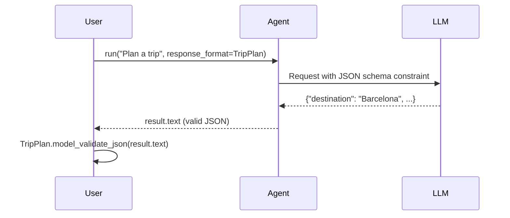

# 07 – Structured Outputs

!!! abstract "Module Goals"
    Use Pydantic models as `response_format` to get typed, structured JSON responses from agents.

## Key Concepts

| Concept | Description |
|---------|-------------|
| `response_format=Model` | Force structured JSON output |
| `BaseModel` | Pydantic schema for response |
| `ConfigDict(extra="forbid")` | Strict schema validation |
| `model_validate_json()` | Parse response into typed object |

## How It Works



## Code

```python title="modules/07_structured_outputs/main.py"
--8<-- "modules/07_structured_outputs/main.py"
```

## Run It

```bash
uv run python modules/07_structured_outputs/main.py
```

## Exercises

- [ ] Create a structured movie recommendation model
- [ ] Create a structured analysis report model
- [ ] Handle validation errors gracefully

!!! tip "Next"
    [08 – Hosted Tools](08-hosted-tools.md)
