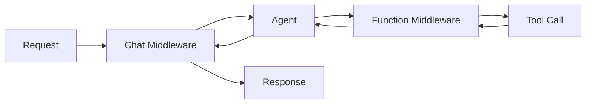

# 10 – Middleware System

!!! abstract "Module Goals"
    Intercept and process agent requests/responses using agent-level and run-level middleware.

## Key Concepts

| Type | Scope | Applied To |
|------|-------|-----------|
| Agent-level middleware | Persistent | ALL runs of an agent |
| Run-level middleware | Temporary | Specific run only |
| `@chat_middleware` | Chat | Request/response interception |
| `@function_middleware` | Tools | Tool call interception |

## Middleware Flow



## Code

```python title="modules/10_middleware_system/main.py"
--8<-- "modules/10_middleware_system/main.py"
```

## Run It

```bash
uv run python modules/10_middleware_system/main.py
```

## Exercises

- [ ] Create a logging middleware
- [ ] Create a security filter middleware
- [ ] Apply middleware at agent-level vs run-level
- [ ] Create a `@function_middleware` for tool auditing

!!! tip "Next"
    [11 – Workflows Sequential](11-workflows-sequential.md)
