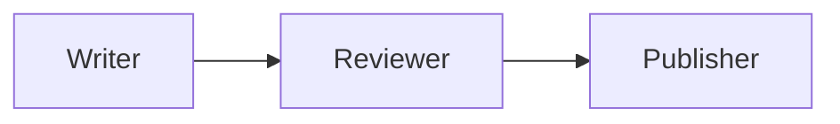

# 11 – Workflows: Sequential

!!! abstract "Module Goals"
    Build linear multi-agent pipelines where agents process data in sequence.

## Key Concepts

| Concept | Description |
|---------|-------------|
| `WorkflowBuilder` | Fluent API for building workflows |
| `set_start_executor()` | Define first agent |
| `add_edge(from, to)` | Connect agents in sequence |
| `.build()` | Compile the workflow |
| `workflow.run()` | Execute the pipeline |

## Pattern



## Code

```python title="modules/11_workflows_sequential/main.py"
--8<-- "modules/11_workflows_sequential/main.py"
```

## Run It

```bash
uv run python modules/11_workflows_sequential/main.py
```

## Exercises

- [ ] Build a content creation pipeline (Writer → Reviewer → Publisher)
- [ ] Build a data pipeline (Extract → Transform → Load)
- [ ] Add a 4th agent to the chain

!!! tip "Next"
    [12 – Workflows Handoff](12-workflows-handoff.md)
