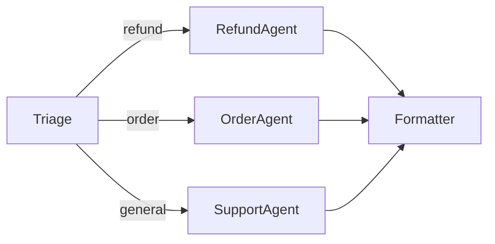

# 12 – Workflows: Handoff

!!! abstract "Module Goals"
    Build conditional routing workflows where a triage agent routes to specialists.

## Key Concepts

| Concept | Description |
|---------|-------------|
| `add_edge(from, to, condition=fn)` | Conditional routing |
| Triage pattern | First agent classifies, then routes |
| Convergence | Multiple branches merge to final agent |

## Pattern



## Code

```python title="modules/12_workflows_handoff/main.py"
--8<-- "modules/12_workflows_handoff/main.py"
```

## Run It

```bash
uv run python modules/12_workflows_handoff/main.py
```

## Exercises

- [ ] Build a customer support handoff
- [ ] Add custom routing condition functions
- [ ] Handle unknown categories gracefully

!!! tip "Next"
    [13 – Workflows Concurrent](13-workflows-concurrent.md)
