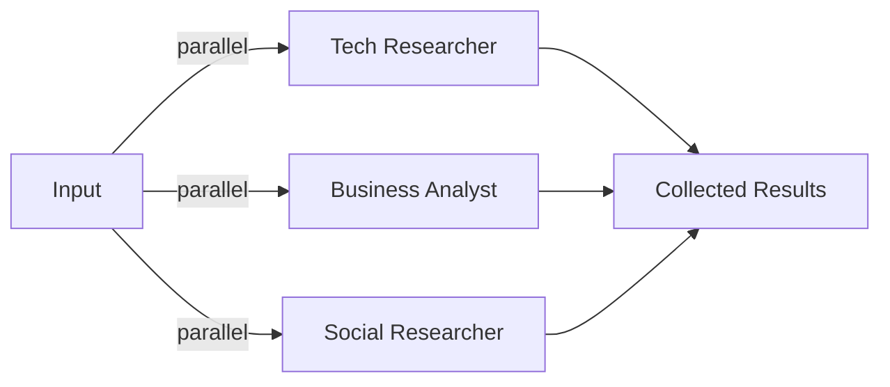

# 13 – Workflows: Concurrent

!!! abstract "Module Goals"
    Run multiple agents in parallel and collect all outputs.

## Key Concepts

| Concept | Description |
|---------|-------------|
| `ConcurrentBuilder` | Build parallel agent execution |
| `.participants([...])` | Define parallel agents |
| `events.get_outputs()` | Collect all results |
| Fan-out pattern | Same input → multiple specialists |

## Pattern



## Code

```python title="modules/13_workflows_concurrent/main.py"
--8<-- "modules/13_workflows_concurrent/main.py"
```

## Run It

```bash
uv run python modules/13_workflows_concurrent/main.py
```

## Exercises

- [ ] Build concurrent multi-perspective analysis
- [ ] Compare concurrent vs sequential performance
- [ ] Aggregate results into a single summary

!!! success "Intermediate Complete!"
    Move on to [Advanced →](../advanced/index.md)
