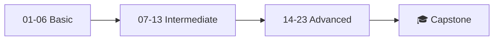

# Learning Plan

## Learning Path: Basic → Intermediate → Advanced

This bootcamp is structured as a step-by-step journey through the Microsoft Agent Framework Python SDK. Each module builds on the previous one.



---

## Prerequisites

| Requirement | Details |
|-------------|---------|
| Python | 3.13+ |
| Azure Subscription | For Azure AI Foundry agents |
| Azure OpenAI | Resource with GPT-4o-mini deployment |
| Package Manager | `uv` (recommended) |

## Environment Setup

```bash
# Install dependencies
uv sync

# Copy and configure environment variables
cp modules/01_setup_and_configuration/.env.example .env
# Edit .env with your credentials

# Validate setup
uv run python modules/01_setup_and_configuration/main.py
```

## How to Use This Bootcamp

1. **Start with Module 01** — set up your environment
2. **Read the module page** — understand concepts before coding
3. **Run the example code** — `uv run python modules/<module>/main.py`
4. **Complete the exercises** — listed at the end of each module
5. **Move to the next module** — each builds on the previous

!!! tip "Recommended Pace"
    - **Basic (01–06)**: 1–2 days
    - **Intermediate (07–13)**: 2–3 days
    - **Advanced (14–23)**: 3–5 days
    - **Capstone**: 1–2 days

---

## Key Imports Reference

```python
# Core
from agent_framework import ChatAgent, AgentRunContext, AgentRunResponse

# Providers
from agent_framework.azure import AzureOpenAIChatClient, AzureAIAgentsProvider
from agent_framework.openai import OpenAIChatClient

# Tools
from agent_framework import HostedCodeInterpreterTool, HostedFileSearchTool
from agent_framework import HostedWebSearchTool, HostedMCPTool, MCPStreamableHTTPTool

# Workflows
from agent_framework import WorkflowBuilder, WorkflowExecutor, ConcurrentBuilder
from agent_framework import Executor, WorkflowContext, WorkflowEvent, handler

# Middleware
from agent_framework import AgentMiddleware, FunctionInvocationContext
from agent_framework import chat_middleware, function_middleware

# Auth
from azure.identity.aio import AzureCliCredential, DefaultAzureCredential
```
